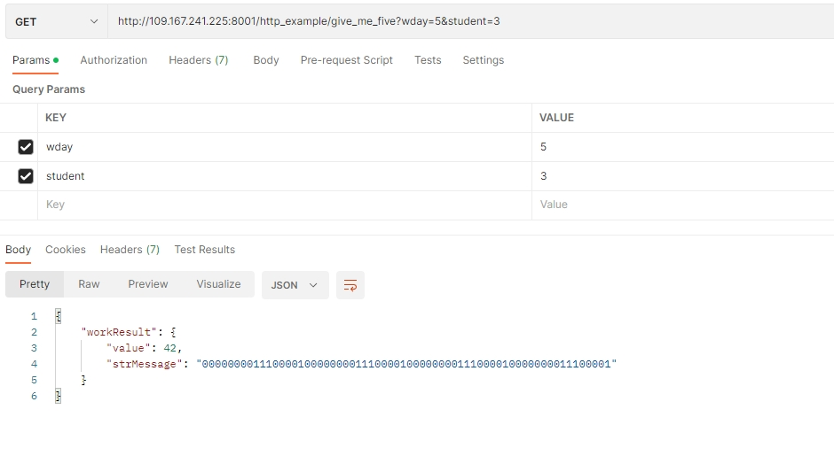

# Лабораторная работа 1. Работа с http протоколом. 

## Задача: Передать http GET запрос напрямую из любого приложения (программного кода), но не из браузера. То есть передать «без мусора», только то что надо. 

##### Сервер: http://109.167.241.225/http_example/ 
#####  Порт: 8001 
##### GET запрос: give_me_five
### Параметры запроса: 
- wday — день недели (вс =1) 
- student — номер в таблице 
### Заголовки: 
- REQUEST_AGENT = ITMO student 
- COURSE = Net Protocols 

> В заголовках больше ничего не должно быть. Сервер присылает ответ — структура из числа и строки. Строка = «бинарное» представление ещё одного числа.


Лог запроса:
```json
GET /http_example/give_me_five?wday=5&student=3 HTTP/1.1
REQUEST_AGENT: ITMO student
COURSE: Net Protocols

HTTP/1.1 200 OK
Connection: Keep-Alive
Server: Embedthis-http
Content-Type: application/json; charset=utf-8
Cache-Control: no-cache
Date: ×ò, 09 ôåâ 2023 09:40:47 GMT
Content-Length: 107
Keep-Alive: timeout=60, max=199

{
  "workResult": {
    "value": 42,
    "strMessage": "0000000011100001000000001110000100000000111000010000000011100001"
  }
}
```
>